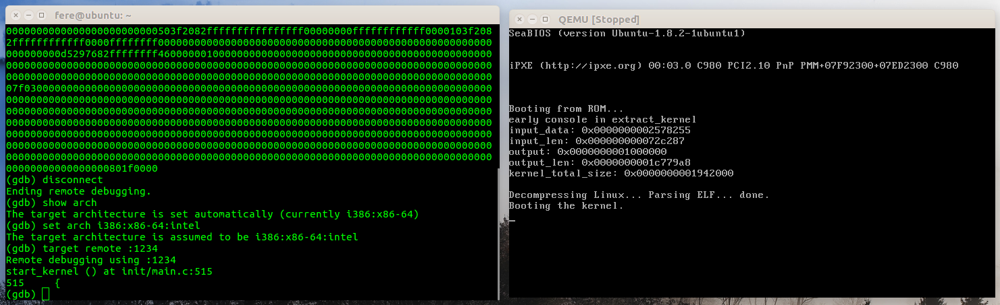
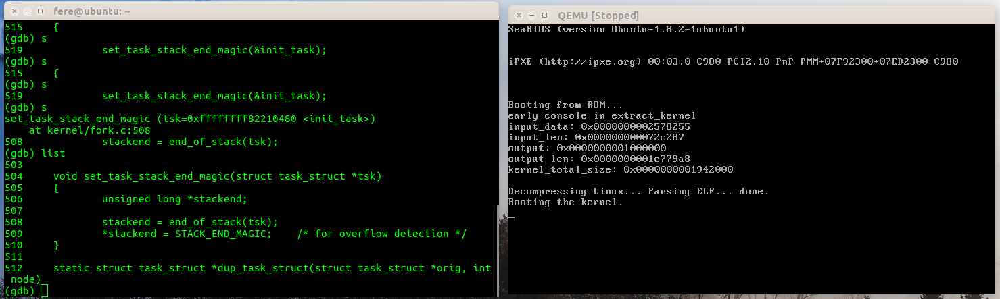
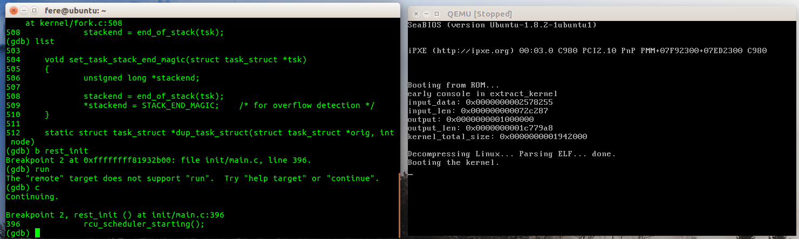
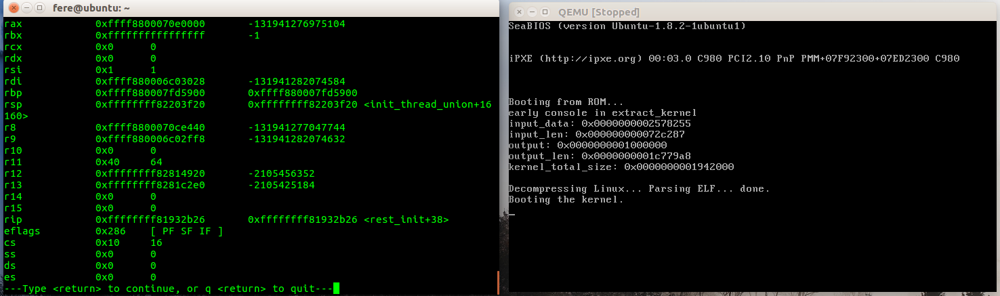
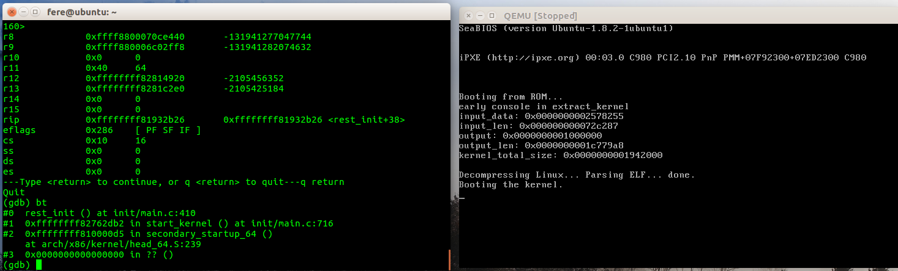

## 操作系统 实验1 实验报告
#### PB16061070 刘时


#### 一 实验说明：  
请使用调试跟踪工具，追踪自己的操作系统（建议Linux）的启动过程，并找出其中至少两个关键事件。  
请提交一份纯文本格式或Markdown格式的实验报告，详述调试中使用的工具、步骤和结果。如有自行编写代码或脚本，请一并提交，并在文档中注明编译或解释环境，如有二进制代码，也可一并提供。

#### 二 实验工具：  
* Ubuntu16.04
* gdb8.1
* QEMU2.5.0

#### 三 实验步骤：  
1. 在 https://www.kernel.org/ 下载最新稳定版内核4.15.15，下载后解压，然后配置内核选项：  
```bash
xz -d linux-4.15.15.tar.xz
tar -xvf linux-4.15.15.tar
cd linux-4.15.15
# 创建 x86_64 的默认内核配置
make x86_64_defconfig
# 手动设置内核选项
make menuconfig
make
```
在内核选项中为使程序能够断点调试，关闭了Processor type and features -> Build a relocatable kernel并打开了Kernel hacking -> Compile-time checks and compiler options -> Compile the kernel with debug info 以及 Generate dwarf4 debuginfo。
2. 编译内核，并使用QEMU执行：
```bash
  qemu-system-x86_64 -kernel ./arch/x86/boot/bzImage -s -S -serial mon:stdio -append "console=ttyS0"
```
3. 在另一个终端中运行gdb：
```bash
# vmlinux 是编译内核时生成的调试文件，在内核源码的根目录中。
gdb vmlinux
# 连接 qemu 进行调试：
target remote :1234
# 设置断点（从main.c中的函数start_kernel开始分析）
b start_kernel
# 执行内核
c
```
这里会出现一个问题：
```bash
Remote 'g' packet reply is too long: ...
```
可以用以下方式解决：
```bash
# 先断开连接
disconnect
# 设置一个不同的 arch
set arch i386:x86-64:intel
# 重新连接
target remote :1234
```
4. 参考文档（https://xinqiu.gitbooks.io/linux-insides-cn/content/Initialization/linux-initialization-4.html 等），定位内核启动过程中的若干关键事件，并做记录。

#### 四 实验结果：
1. start_kernel:

之后重点关注此句：

```c
set_task_stack_end_magic(&init_task);
```
由list操作可得到该函数内容：
```c
void set_task_stack_end_magic(struct task_struct *tsk)
{
	unsigned long *stackend;

	stackend = end_of_stack(tsk);
	*stackend = STACK_END_MAGIC;	/* for overflow detection */
}
```

下面分析该函数的作用：
该函数有两个参数，分别为为init_task和设置STACK_END_MAGIC (0x57AC6E9D)。其中init_task代表初始化进程(任务)数据结构，存储了进程的所有相关信息，而STACK_END_MAGIC作为栈底的地址值。这个函数被定义在kernel/fork.c，功能为设置 canary init 进程堆栈以检测堆栈溢出，先通过 end_of_stack 函数获取堆栈并赋给 task_struct，再在栈底写STACK_END_MAGIC的值。该函数使0号进程开始运行。

随后初始化继续执行，第二个想要重点关注的函数是
```c
rest_init();
```

这一函数较长，在gdb中得到函数与start_kernel在同一文件中后，可在网站上得到函数源码：
```c
static noinline void __ref rest_init(void)
{
	struct task_struct *tsk;
	int pid;

	rcu_scheduler_starting();
	/*
	 * We need to spawn init first so that it obtains pid 1, however
	 * the init task will end up wanting to create kthreads, which, if
	 * we schedule it before we create kthreadd, will OOPS.
	 */
	pid = kernel_thread(kernel_init, NULL, CLONE_FS);
	/*
	 * Pin init on the boot CPU. Task migration is not properly working
	 * until sched_init_smp() has been run. It will set the allowed
	 * CPUs for init to the non isolated CPUs.
	 */
	rcu_read_lock();
	tsk = find_task_by_pid_ns(pid, &init_pid_ns);
	set_cpus_allowed_ptr(tsk, cpumask_of(smp_processor_id()));
	rcu_read_unlock();

	numa_default_policy();
	pid = kernel_thread(kthreadd, NULL, CLONE_FS | CLONE_FILES);
	rcu_read_lock();
	kthreadd_task = find_task_by_pid_ns(pid, &init_pid_ns);
	rcu_read_unlock();

	/*
	 * Enable might_sleep() and smp_processor_id() checks.
	 * They cannot be enabled earlier because with CONFIG_PRREMPT=y
	 * kernel_thread() would trigger might_sleep() splats. With
	 * CONFIG_PREEMPT_VOLUNTARY=y the init task might have scheduled
	 * already, but it's stuck on the kthreadd_done completion.
	 */
	system_state = SYSTEM_SCHEDULING;

	complete(&kthreadd_done);

	/*
	 * The boot idle thread must execute schedule()
	 * at least once to get things moving:
	 */
	schedule_preempt_disabled();
	/* Call into cpu_idle with preempt disabled */
	cpu_startup_entry(CPUHP_ONLINE);
}
```
下面简要介绍函数的功能：
函数中的第一个调用rcu_scheduler_starting使RCU调度器开始工作，而第二个调用smpboot_thread_init记录了一个CPU通知器。
接下来，两次kernel_thread调用创建了两个新的内核线程 kernel_int 和 kthreadd，分别赋予 PID 1 和 2。
接下来，函数调用了 find_task_by_pid_ns 返回了输入 pid 的 tast_struct 指针，这里就分别为 kernel_int 和 kthreadd 的指针。（find_task_by_pid_ns 调用上下的两个函数分别开始和结束一个RCU读面关键段，是用来保护中间的函数调用的。）之后一行将系统的状态（system_state）更改为调度状态（ SYSTEM_SCHEDULING）。
之后，函数调用了complete函数。completion 是一种代码同步机制，用于解决某些线程需要等待其他线程运行一段时间的情况。而complete是使用这种机制的最后一步。
最后调用的两个函数，前者禁止空任务的占用，而后者用来跑空CPU周期，当当前没有进程在运行时，这一进程就开始运行，以保证CPU持续活跃。
总之，rest_init()完成了内核启动中的一些剩余初始化工作。

在调试过程中，随时可以在 gdb 使用 info register 来查看当前寄存器值，用 bt 来查看当前函数递归工作栈信息等，不过本次实验中没有使用这些工具。



#### 五 体会：
在本次实验中，我掌握了基本的 linux terminal 使用方法以及 gdb、qemu 等软件的使用方法，通过调试和研究资料的方式对 linux 内核启动过程中的部分关键活动有了一个初步的了解。但由于时间仓促，本次实验中并没有仔细研究各个函数的原理与实现，对内核启动过程的总体掌握也还很欠缺，需要在后续投入更多时间进一步学习。
